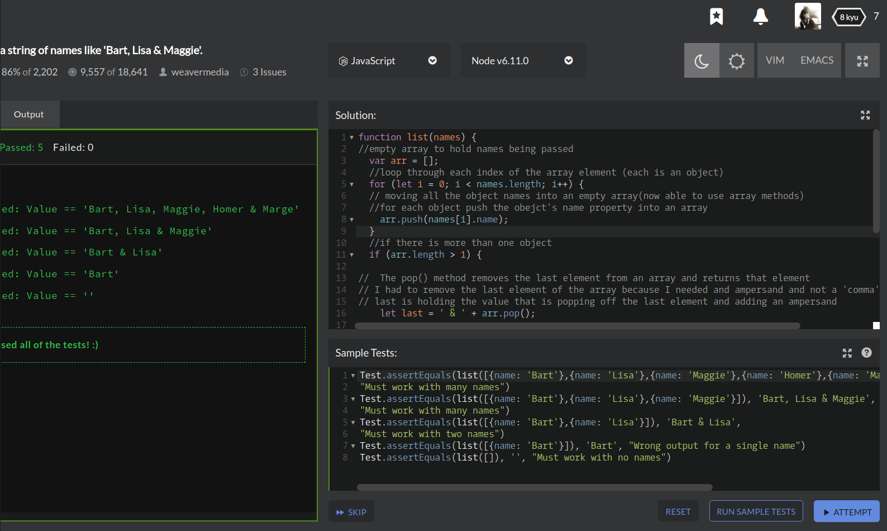

## CodeWars Challenge- 3

Given: an array containing hashes of names

Return: a string formatted as a list of names separated by commas except for the last two names, which should be separated by an ampersand.

*Examples Given:*

1. list([ {name: 'Bart'}, {name: 'Lisa'}, {name: 'Maggie'} ])
// returns 'Bart, Lisa & Maggie'

2. list([ {name: 'Bart'}, {name: 'Lisa'} ])
// returns 'Bart & Lisa'

3. list([ {name: 'Bart'} ])
// returns 'Bart'

4. list([])
// returns ''

## Languages Used

1. JavaScript

## My solution:

My first attempt is commented out at the bottom of the main.js file.
After this attempt I decided to tackle this problem in a different manner
and pushing each object's names into an empty array I call arr.

Now that each object's name value, the name, has been pushed into an array I can use array methods.

Next I add a conditional to check how many elements are in the array, if more than one is present then the function needs to return each element in the array as a string separated by commas. I'll admit it was tricky figuring out how I could add the ampersand to separate the last two names, this is where having the names in an array helped me, as I could use the pop() method to pop off the last element(the last name), add in an ampersand and then return the popped off element. Thanks to the helpful join() method the last thing left to do was separate the names with commas and spaces.

If there is only one element present then the join method automatically joins array elements and returns a string, making it the only step executed in my else statement. 
